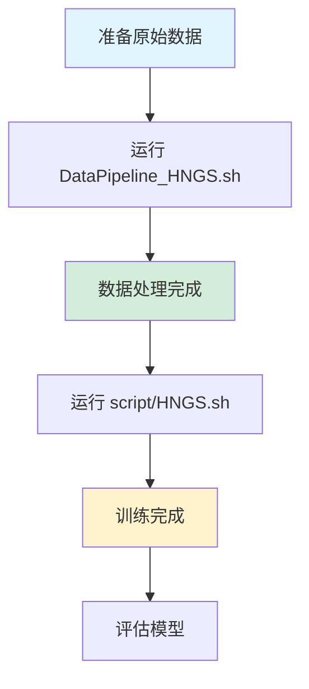

# 湖南高速公路数据集适配方案 - 文件清单 📋

## ✅ 已创建的文件列表

### 1. 数据管道脚本 (DataPipeline/)

| 文件名 | 作用 | 说明 |
|--------|------|------|
| `generate_hngs_data.py` | 数据转换主脚本 | 读取原始 Excel/CSV，生成标准格式数据 |
| `generate_hngs_training_data.py` | 训练数据生成 | 添加时间特征（TOD、DOW） |
| `process_hngs_adj.py` | 邻接矩阵处理 | 转换为 pickle 格式 |
| `generate_hngs_idx.py` | 索引生成 | 划分训练/验证/测试集 |
| `create_sample_data.py` | 示例数据生成 | 创建模拟数据用于测试 |

### 2. 自动化脚本 (根目录)

| 文件名 | 作用 |
|--------|------|
| `DataPipeline_HNGS.sh` | 一键执行完整数据处理流程 |
| `script/HNGS.sh` | 一键训练 FaST 模型 |

### 3. 模型配置文件 (main-master/FaST/)

| 文件名 | 预测长度 | 用途 |
|--------|---------|------|
| `HNGS_96_48.py` | 48 步（12 小时） | 短期预测配置 |
| `HNGS_96_96.py` | 96 步（24 小时） | 中期预测配置 |

### 4. 数据集文件 (main-master/datasets/HNGS/)

| 文件名 | 作用 |
|--------|------|
| `desc.json` | 数据集描述文件 |

### 5. 文档

| 文件名 | 内容 |
|--------|------|
| `README_HNGS.md` | 详细使用指南（包含高级配置） |
| `QUICKSTART_HNGS.md` | 快速启动指南（3 步开始） |
| `FILES_CREATED_HNGS.md` | 本文件，文件清单 |

---

## 🎯 使用流程



---

## 📝 关键参数说明

### 你的数据集信息
- **站点数**：161 个（黄兴到芙蓉镇）
- **时间范围**：2023 年 9 月 1 日 - 10 月 31 日
- **总时间点数**：约 5952 个（2 个月 × 31 天 × 96 个/天）
- **数据频率**：15 分钟

### 默认配置
- **输入长度**：96 步（24 小时）
- **预测长度**：48 步（12 小时）或 96 步（24 小时）
- **训练集比例**：60%
- **验证集比例**：20%
- **测试集比例**：20%

### 模型架构
- **FaST 层数**：3 层
- **专家数量**：8 个
- **隐藏维度**：64
- **代理节点**：32 个
- **批量大小**：32

---

## 🔧 邻接矩阵说明

由于高速公路站点是**线性排列**的（沿着高速公路），默认使用**序列邻接**：

```python
# 每个站点只与前后相邻站点连接
Station_i ←→ Station_(i-1)
Station_i ←→ Station_(i+1)
```

如果你想使用**距离邻接**（基于实际地理位置）：
1. 在 `generate_hngs_data.py` 中填入真实经纬度
2. 修改 `adj_method = 'distance'`

---

## ⚠️ 重要注意事项

### 1. 数据质量检查
在处理前，请确保：
- ✅ 没有大量连续缺失值
- ✅ 时间戳连续且规律
- ✅ 流量值在合理范围内

### 2. 数据量评估
- 2 个月数据 ≈ 5952 个时间点
- 按 6:2:2 分割后：
  - 训练集：~3571 样本
  - 验证集：~1190 样本
  - 测试集：~1191 样本

**建议**：如果可能，收集更长时间的数据（3-6 个月）

### 3. 预测长度选择
根据你的应用需求：
- **短期预测**（未来几小时）：用 `HNGS_96_48.py`
- **中期预测**（未来 1 天）：用 `HNGS_96_96.py`
- **长期预测**（未来 2-7 天）：需要创建新配置并增加数据量

---

## 🚀 下一步行动

### 立即开始：
1. 将你的数据文件放到 `DataPipeline/` 目录
2. 运行 `bash DataPipeline_HNGS.sh`
3. 运行 `bash script/HNGS.sh`

### 进阶优化：
1. 阅读 [`README_HNGS.md`](README_HNGS.md) 了解高级配置
2. 调整模型参数以获得更好性能
3. 尝试不同的邻接矩阵构建方法
4. 与其他基线模型对比

---

## 📊 预期输出

训练完成后，你会得到：

```
checkpoints/FaST/HNGS_50_96_48/
├── FaST_best_val_MAE.pt      # 最佳模型权重
├── training_log.txt          # 训练日志
└── evaluation_log.txt        # 评估结果
```

**评估指标**：
- MAE < 10 （优秀）
- RMSE < 15 （良好）
- MAPE < 10% （可接受）

---

## 💡 技巧与建议

1. **首次运行**：先用 `create_sample_data.py` 生成的模拟数据测试流程
2. **显存不足**：减小 `BATCH_SIZE` 或关闭 `fp16`
3. **训练不稳定**：降低学习率或增加 warmup
4. **预测不准**：检查数据质量，调整邻接矩阵

---

**祝你实验顺利！** 🎉

如有问题，请查看详细文档或检查日志文件。
